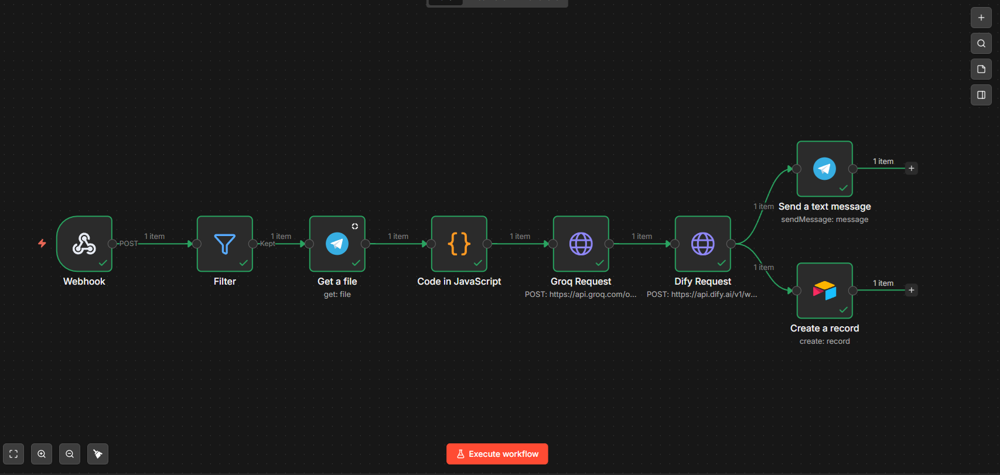

# AI Voice-to-CRM Lead Extractor & Validator

An end-to-end microservice architecture designed to automate the B2B sales lead qualification process. It captures voice messages from clients, transcribes them in milliseconds, extracts structured commercial entities (Location, Budget) using LLMs, validates the output, and automatically synchronizes the data with a CRM.

## 🏗 Architecture & Logic Flow

This project strictly follows the **Separation of Concerns** principle:
* **Integration Layer (n8n):** Handles webhooks, binary file processing, and API routing.
* **AI Orchestration Layer (Dify):** Manages LLM prompts, Chain-of-Thought reasoning, and JSON generation.

### High-Level Business Logic

### Low-Level Implementation (n8n)

## 🛠 Tech Stack

| Component | Technology | Role in the Pipeline |
| :--- | :--- | :--- |
| **Transport & Automation** | n8n | Webhook ingestion, binary data processing, API routing, error handling. |
| **STT (Speech-to-Text)** | Groq (Whisper API) | Ultra-low latency voice transcription (<1 sec turnaround). |
| **AI Orchestrator** | Dify | LLM prompt chaining, flow control, and Voice UX generation. |
| **LLM Engine** | OpenAI (GPT-4o-mini) | Few-shot extraction of entities (City, Budget) into strict JSON format. |
| **Database / CRM** | Airtable | Relational database for storing qualified leads. |
| **Client Interface** | Telegram API | Voice input reception and AI-generated confirmation delivery. |

## 🚀 Key Features & Engineering Decisions

1. **Fault Tolerance & JSON Validation:** LLMs can hallucinate. The architecture includes validation nodes to check if the generated JSON is structurally sound and contains mandatory fields. Invalid outputs are routed to an admin notification channel (Error Logging) instead of corrupting the CRM database.
2. **Ultra-Fast Processing:** By utilizing Groq's LPU inference engine for Whisper, transcription latency is practically eliminated, creating a seamless real-time experience for the end user.
3. **Voice UX Generation:** A secondary LLM node is dedicated solely to formatting the extracted data into a polite, human-like confirmation message tailored to the client's context.

## 📂 Repository Contents

* `n8n%20API%20Middleware.json` — The complete n8n pipeline (ready to import).
* `Sales_Data_Extractor.yml` — The Dify DSL export containing LLM configurations and prompt structures.
* `Ai%20экстрактор.png` — High-level architecture logic flow.
* `n8n_скрин.png` — Low-level implementation in n8n.

## ⚙️ How to Deploy

1. Import the `n8n API Middleware.json` into your n8n instance.
2. Import the `Sales_Data_Extractor.yml` into your Dify workspace.
3. Replace the placeholder API Keys in the credential nodes (Telegram, Groq, Dify, Airtable).
4. Map the Airtable columns (`City`, `Budget`, `Status`) in the final n8n node to match your specific base schema.
